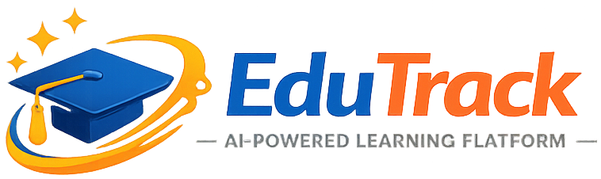

# 🎓 EduTrack

<p align="center">
  
</p>

<h3 align="center">
An AI-Powered Learning Management System (LMS)
</h3>

<p align="center">
Built using <strong>Flask • SQLite • HTML • CSS • JavaScript</strong>
</p>

---

# 📖 About

EduTrack is a modern Learning Management System (LMS) developed using Flask and SQLite. It provides learners with an interactive platform to explore courses, watch instructor videos, access detailed study notes, track learning progress, and manage their profile.

The platform also includes an Admin Module for managing learners and will soon include AI-powered learning assistance, quizzes, certificate generation, and course management.

---

# ✨ Features

## 👨‍🎓 Learner Module

- ✅ Learner Registration
- ✅ Learner Login
- ✅ Personalized Dashboard
- ✅ Explore Courses
- ✅ Select Video Language
- ✅ Choose Instructor
- ✅ Embedded YouTube Course Playlists
- ✅ Python Programming Notes
- ✅ Java Programming Notes
- ✅ SQL Database Notes
- ✅ Download Notes (PDF)
- ✅ My Progress Page
- ✅ Certificates Page
- ✅ My Profile
- ✅ Responsive Sidebar Navigation

---

## 👨‍💼 Admin Module

- ✅ Admin Dashboard
- ✅ Add Learners
- ✅ Edit Learners
- ✅ Delete Learners
- ✅ Search Learners
- ✅ Export Learner Data to CSV

---

# 🚀 Upcoming Features

- 🔐 Admin Authentication
- 📚 Course Management
- 👨‍🏫 Instructor Management
- 📝 Quiz System
- 📊 Real Progress Tracking
- 🏆 Automatic Certificate Generation
- 🤖 AI Study Assistant (Gemini API)
- 🎯 Personalized Course Recommendations
- 🌙 Dark Mode
- ☁️ Cloud Deployment

---

# 🌟 Highlights

- Modern Learning Management System
- Clean & Responsive UI
- Flask Backend
- SQLite Database
- Role-Based Architecture
- Modular Project Structure
- Embedded Video Learning
- Downloadable Notes
- Progress Tracking Interface
- Certificate Module
- Easy to Extend

---

# 🛠 Tech Stack

| Technology | Purpose |
|------------|---------|
| Python | Backend |
| Flask | Web Framework |
| SQLite | Database |
| HTML5 | Frontend Structure |
| CSS3 | Styling |
| JavaScript | Client-side Interactivity |
| Font Awesome | Icons |
| Git | Version Control |
| GitHub | Repository Hosting |

---

# 📂 Project Structure

```text
EduTrack/
│
├── app.py
├── requirements.txt
├── README.md
│
├── database/
│   └── edutrack.db
│
├── static/
│   ├── css/
│   │   ├── style.css
│   │   └── notes.css
│   │
│   ├── js/
│   │   └── script.js
│   │
│   ├── images/
│   │
│   └── notes/
│       └── pdf/
│
├── templates/
│   │
│   ├── notes/
│   │   ├── python.html
│   │   ├── java.html
│   │   └── sql.html
│   │
│   ├── landing.html
│   ├── learner_login.html
│   ├── learner_dashboard.html
│   ├── learner_courses.html
│   ├── choose_video_language.html
│   ├── choose_instructor.html
│   ├── course.html
│   ├── progress.html
│   ├── certificates.html
│   ├── profile.html
│   ├── register.html
│   ├── admin_dashboard.html
│   └── edit.html
│
└── venv/
```

---

# 📸 Screenshots

### 🏠 Landing Page

*(Add Screenshot)*

---

### 📊 Learner Dashboard

*(Add Screenshot)*

---

### 📚 Explore Courses

*(Add Screenshot)*

---

### 🎥 Course Learning Page

*(Add Screenshot)*

---

### 📈 My Progress

*(Add Screenshot)*

---

### 🏆 Certificates

*(Add Screenshot)*

---

### 👤 My Profile

*(Add Screenshot)*

---

### 👨‍💼 Admin Dashboard

*(Add Screenshot)*

---

# 🚀 Getting Started

## 1️⃣ Clone the Repository

```bash
git clone https://github.com/Mashood-git/EduTrack.git
```

---

## 2️⃣ Move into the Project

```bash
cd EduTrack
```

---

## 3️⃣ Create Virtual Environment

```bash
python -m venv venv
```

---

## 4️⃣ Activate Virtual Environment

### Windows

```bash
venv\Scripts\activate
```

### Linux / macOS

```bash
source venv/bin/activate
```

---

## 5️⃣ Install Dependencies

```bash
pip install -r requirements.txt
```

---

## 6️⃣ Run the Project

```bash
python app.py
```

---

## 7️⃣ Open in Browser

```
http://127.0.0.1:5000
```

---

# 🎯 Roadmap

## ✅ Phase 1

- Learner Registration
- Learner Login
- Dashboard
- Explore Courses
- Embedded Videos
- Study Notes

---

## ✅ Phase 2

- Progress Page
- Certificates Page
- Learner Profile

---

## 🚧 Phase 3

- Admin Login
- Course Management
- Instructor Management

---

## 🚧 Phase 4

- Quiz System
- AI Study Assistant
- Certificate Generation
- Progress Analytics

---

# 💡 Future Improvements

- AI Chatbot using Gemini API
- Course Recommendation Engine
- Leaderboard & Gamification
- Email Notifications
- Password Encryption
- Profile Picture Upload
- Attendance Tracking
- Discussion Forum
- Mobile Responsive Improvements

---

# 🤝 Contributing

Contributions are welcome!

If you'd like to improve EduTrack:

1. Fork the repository
2. Create a new branch

```bash
git checkout -b feature-name
```

3. Commit your changes

```bash
git commit -m "Added new feature"
```

4. Push to your branch

```bash
git push origin feature-name
```

5. Open a Pull Request

---

# 📜 License

This project is developed for educational and portfolio purposes.

---

# 👨‍💻 Developer

**Mashood Ahmed Shariff**

🎓 Artificial Intelligence & Machine Learning Engineer

GitHub:
https://github.com/Mashood-git

LinkedIn:
(Add Your LinkedIn Profile)

---

# ⭐ Support

If you like this project, please consider giving it a ⭐ on GitHub.

It helps the project reach more developers and motivates future improvements.

---

<h3 align="center">
Thank you for visiting EduTrack ❤️
</h3>